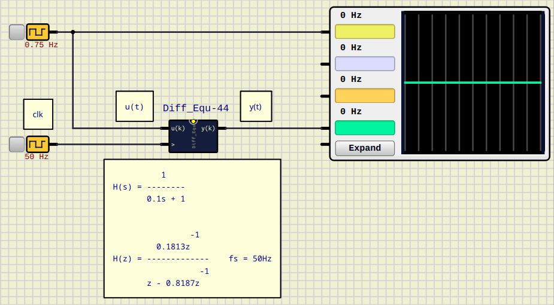
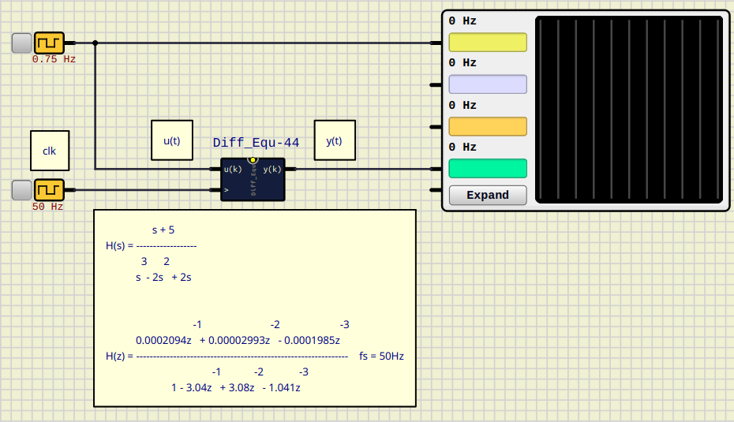

# Differential Equation Block on SimulIDE

This example implements a Differential Equation Block simulation on [SimulIDE](https://simulide.com/p/), as a Script (_Angel Script_).

This is done for implementing discrete system simulations on *SimulIDE*.

This repository includes 2 usage examples:

- `Diff_Equ_test.sim1` RC discrete circuit simulation $f_s = 50 Hz$

- `Diff_Equ_test_2.sim1` Unstable 3rd order system simulation $f_s = 50 Hz$

## Usage 
You have to copy the component's folder inside a one in the user data folder, for instance `~/User_data/test`and associate it in Simulide.
You can see how to do this in the official SimulIDE's Tutorials:

- [User data folder SimulIDE 1.1.0](https://www.youtube.com/watch?v=pAU7fdUWCqs)

- [Crear Componentes SimulIDE 1.1.0 ](https://www.youtube.com/watch?v=LBknR6y5Qho) (Spanish)