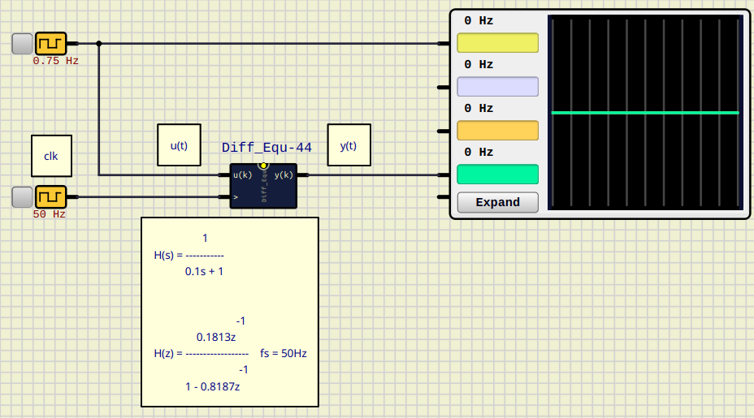

# Difference Equation Block on SimulIDE

This example implements a difference Equation (up to $3^{rd}$ order) Block simulation on [SimulIDE](https://simulide.com/p/), as a Script (_Angel Script_).

This is done for implementing discrete system simulations on *SimulIDE*.

This repository includes 2 usage examples:

- `Diff_Equ_test.sim1` RC discrete circuit simulation $f_s = 50 Hz$

- `Diff_Equ_test_2.sim1` Unstable 3rd order system simulation $f_s = 50 Hz$

## Usage
You have to copy the component's folder inside a one in the user data folder, for instance `~/User_data/test`and associate it in Simulide.
You can see how to do this in the official SimulIDE's Tutorials:

- [User data folder SimulIDE 1.1.0](https://www.youtube.com/watch?v=pAU7fdUWCqs)

- [Crear Componentes SimulIDE 1.1.0 ](https://www.youtube.com/watch?v=LBknR6y5Qho) (Spanish)

The difference equation constants:

$$
H(z) = \frac{B_0 \cdot z^{0} + B_1 \cdot  z^{-1} + B_2 \cdot z^{-2} - B_3 \cdot z^{-3}}
            {A_0 \cdot z^{0} + A_1 \cdot  z^{-1} + A_2 \cdot z^{-2} - A_3 \cdot z^{-3}}
$$

can be set once the block `Diff_Equ` is added to the schematic, left-clicking on the component and selecting `properties`option:

